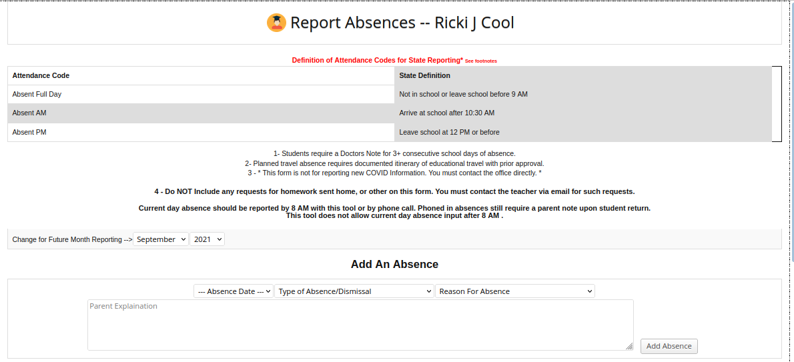
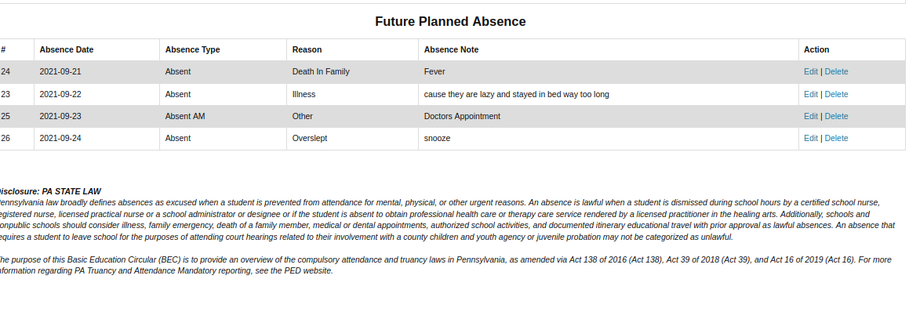
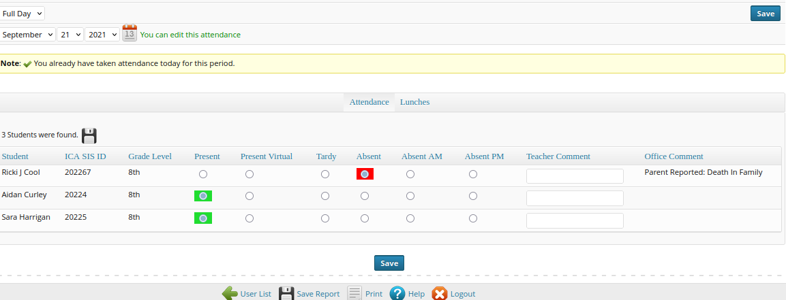
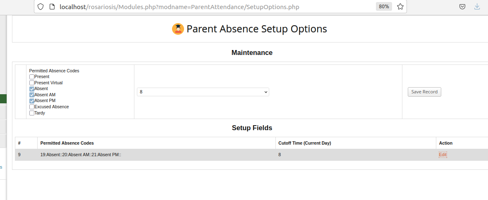
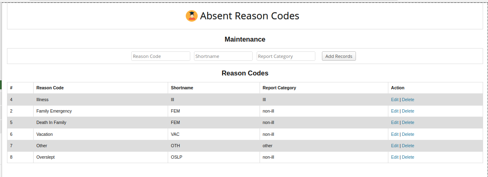

Parent Attendance Module
==============================

Version 1.0 - Sept, 2021

Author Gregory J. Forkin, Doc STEM

License MIT

DESCRIPTION
-----------
This module adds the ability for Parents to report Student Absence in 
advance of the school Attendance Process. The time Parents may report 
up and until is cutoff based on the deadline in the ParentAttendance 
Option Screen. 
This is to avoid conflict with teacher taking absence. These records 
are marked with the parent's username.
The ParentAttendance Option Screen has a future date that allows for
Parents to report future absences. Example Planned Family trip in Dec.

NOTE: In US Elementary Schools, attendance is usually taken in HOMEROOM
for the full day. Parents must inform of early dismissal or late arrival
that is beyond tardy. Because of this Parents only need to mark the 
HOMEROOM class for attendance.

Developer Note: if you need a by period absence, you can modify the drop
down of CLASS to include anything where the course period has a 
does_attendance not null or if only lunch modify for 0, only

Teachers when taking attendance find the student marked with information already. Goal, between 
automatic & parent submitting absence, teachers should spend almost no time on Attendance.

### INSTALL
-------
Copy the `ParentAttendance/` folder (if named `ParentAttendance-master`, rename it) and its content inside the `modules/` folder of RosarioSIS.

Go to _School Setup > School Configuration > Modules_ and click "Activate".

Requires RosarioSIS 5.5+  -- Say Hey to Francois

### SETUP
---------

To set the module up, use these steps after install.

	- As administrator go to the Parent Absence Setup Options
	- Fill in the options per you cutoff time for Parents to enter Future or today's absent reason

	- Fill in the codes that Parents are permitted to use 
	- Goto the Absent Reason Code Screen and populate some pre-defined reasons for absence (ex. sice, family emergency, etc.)

	- in text editor you probably want to edit the STATE Absence Law for Truancy... Currently the USA, PA truancy law is in the message.
	- Make sure in Profile security Parents have access and your done.

